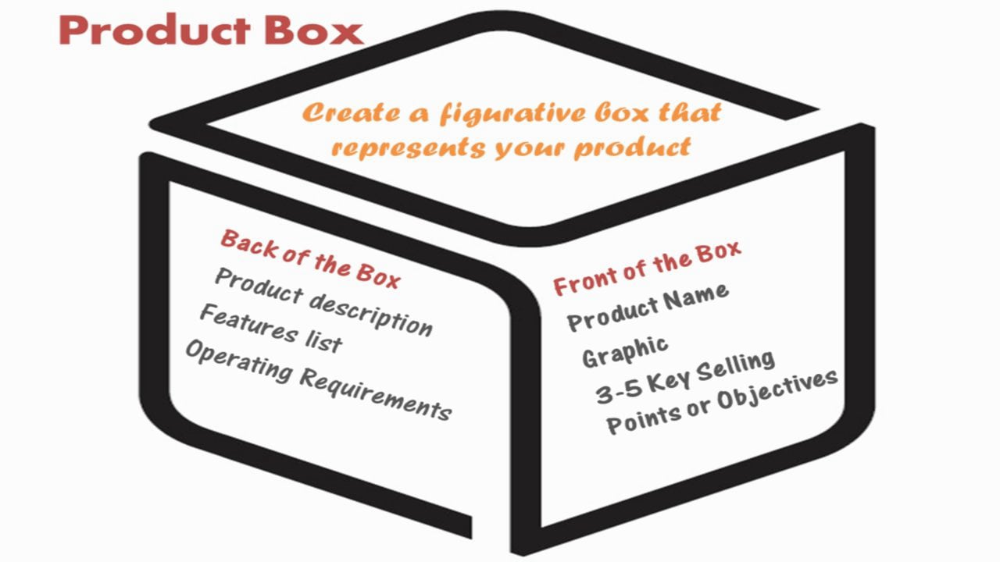

```{r setup, include=FALSE}
knitr::opts_chunk$set(echo = FALSE)
source("content.R")
```
Locatie: `r paste0(adres, " (", extra, ")")`
<a href='https://goo.gl/maps/1dgHpkwo1M92'>Routebeschrijving</a>
<br>

```{r results='asis', echo=FALSE, message=FALSE}
library(gsheet)
library(googleVis)
URL <- "https://docs.google.com/spreadsheets/d/1Y2QJUQKQm0ztGmteUnT39B_eqBH1GENkILdjHIUYmMk/edit#gid=2005855851"
tblPrgr <- gsheet2tbl(URL)

Programma <- gvisTable(tblPrgr, options=list(width='600'))
plot(Programma)
```

<br>
We zullen in drie groepen gaan werken aan een aantal opdrachten. Het doel van de eerste opdracht (*"Visioning"*) is de verschillende visies op Smart Industry en de betekenis hiervan voor ons onderwijs te inventariseren.

Daarna gaan we bespreken welke elementen (*"Features"*) het onderwijs moet bevatten om effect te hebben en hoe we deze elementen samen kunnen toevoegen. Het resultaat moet een verzameling van concrete afspraken zijn, waarop we het programma van de minor Smart Industry kunnen gaan bouwen.
<br>

# Sessies {.tabset .tabset-fade}

## Visioning
In deze sessie willen we onderzoeken welke verwachtingen onze partnerorganisaties hebben van de minor. Welke behoeftes hebben ze op het vlak van Smart Industry en voor welke daarvan biedt de minor een uitkomst? Om hierachter te komen gebruiken we een instrument dat wordt toegepast bij Agile [softwareontwikkeling](http://reqtest.com/agile-blog/how-to-build-a-product-vision-box-and-clarify-your-software-goals/): de **product vision box**.

Aan de deelnemers wordt gevraagd zich voor te stellen dat de minor een product is dat verpakt zit in een doos en dat de doos moet worden vormgegeven. We gaan de voorkant en de achterkant van de doos ontwerpen.

<br>

<br>

Als hulpmiddel bij het ontwerpen, kunnen volgende vragen worden gesteld:

* **Wie?** Voor welke organisaties kan de minor een toegevoegde waarde hebben en in welke termen kan hier het beste over worden gecommuniceerd?
* **Wat?** Wat moet de minor bieden aan deze organisaties? Hoe kan de minor helpen doelen op het gebied van Smart Industry te bereiken?
* **Wanneer?** Binnen welke termijnen verwacht men dat de minor resultaten oplevert?
* **Waar?** Op welke plekken / locaties / momenten vindt interactie plaats tussen de minor en de organisaties?
* **Waarom?** Welke andere instrumenten kunnen organisaties inzetten om eerder genoemde doelen te bereiken en in welke mate is de minor een goed alternatief hiervoor?

We werken met teams van 2-3 personen. Voor het ontwerpen van de doos is 45 minuten gereserveerd. Het ontwerp wordt daarna kort (5 minuten) gepresenteerd aan de overige groepsleden. De moderatoren zullen zich niet mengen in het creatieproces. Ze dienen slechts om opdrachten te verduidelijken, te zorgen dat de sessies vlot verlopen en de gegenereerde informatie te verzamelen.

### Uitleg Visioning (Video 5:18 minuten)

<iframe width="560" height="315" src="https://www.youtube.com/embed/Y_-f2CZELrw?start=1349&end=1667" frameborder="0" allowfullscreen></iframe>

## Features
Iedereen heeft tijdens de vorige sessie over de visie kunnen nadenken en discussiëren en een beeld van wat de uitkomsten moeten zijn. Het doel van deze sessie is om te inventariseren welke activiteiten we samen kunnen opzetten, zodat we naar deze uitkomsten toewerken.

Er is een [overzicht](https://docs.google.com/spreadsheets/d/1UqRNnbRLGKblvT59js7NU3g3olrkn-QcBuqpEQg_7GE/edit?usp=sharing) gemaakt van alle collegeweken. Dit overzicht zal zichtbaar zijn op een scherm of kan via eigen devices worden benaderd. Iedereen kan hier direct in werken en zijn aanbod toevoegen.

Bedenk of het mogelijk is om in samenwerking met partijen die aanwezig zijn activiteiten te ontwikkelen en gezamenlijk aan te bieden. Onder het schema worden een aantal suggesties gedaan voor mogelijke werkvormen. Andere ideeën kunnen aan deze lijst worden toegevoegd.

Vul op het overzicht in op welk moment je welke activiteit wilt verzorgen. **Vergeet niet de naam van je organisatie toe te voegen**. Het kan voorkomen dat een andere organisatie op hetzelfde moment iets wil aanbieden. Voeg in dat geval je eigen aanbod toe onder die van de ander (in dezelfde cel).
<br>

### User Personas
Om een beter beeld te krijgen van de studenten die we bedienen hebben we hebben een aantal van hen gevraagd *User Personas* te ontwikkelen op basis van hun eigen behoeftes en hun inschatting van hun peers. De resultaten zijn verzameld in een presentatie.<br>

<iframe src="https://docs.google.com/presentation/d/1VPP0DKXRF-fPC0-3ik--BTdOo-39_GJDGkg9xXWHI6k/embed?start=true&loop=true&delayms=5000" frameborder="0" width="800" height="474" allowfullscreen="true" mozallowfullscreen="true" webkitallowfullscreen="true"></iframe>


## Groepsindeling

```{r results='asis', echo=FALSE, message=FALSE}
library(gsheet)
library(htmlTable)

URL <- "https://docs.google.com/spreadsheets/d/1Y2QJUQKQm0ztGmteUnT39B_eqBH1GENkILdjHIUYmMk/pub?gid=1904294464&single=true&output=csv"
dataIndeling <- gsheet2tbl(URL)
names(dataIndeling) <- NULL

tblIndeling <- htmlTable(dataIndeling,
                             cgroup=c("Groep", "Moderator", "Thema", "Deelnemers"),
                             n.cgroup=c(1,1,1,ncol(dataIndeling)-3),
                             align="lllllll",
                             rnames=FALSE,
                             css.cell = c("padding-left: .5em; padding-right: .8em;",
                                          "padding-left: .5em; padding-right: .8em;",
                                          "padding-left: .5em; padding-right: .8em;",
                                          "padding-left: .5em; padding-right: .8em;",
                                          "padding-left: .5em; padding-right: .8em;",
                                          "padding-left: .5em; padding-right: .8em;",
                                          "padding-left: .5em; padding-right: .8em;",
                                          "padding-left: .5em; padding-right: .8em;"),
                             col.columns = c("none", "#F2F9FF"),
                             col.rgroup = c("none", "#F2F4F4")
                         )
tblIndeling

```